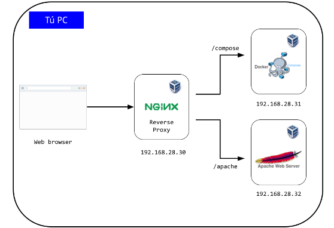

# proxy inverso nginx

### General Info
Despliegue de un ambiente computacional distribuido, realizado mediante nginx utilizado como reverse proxy, 
que redirige a una app de docker-compose, o a un server de apache, esto utilizando las tecnologías de virtualbox y Vangrant.

### Screenshot


### Requisitos
```
 git
 virtualbox
 vangrant
```

### Instalación
```
$ git clone https://github.com/JoshuaAAX/proxy-inverso-nginx/
$ vagrant up
```


